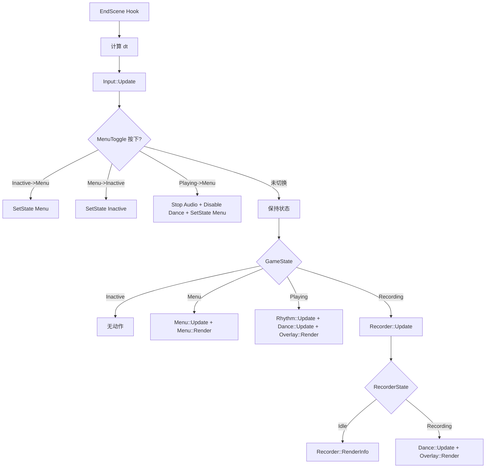
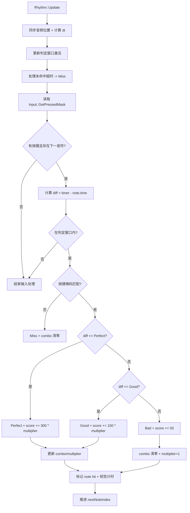

# CarbonRhythm 项目架构与技术栈

本文基于对项目源码与目录结构的梳理，输出整体架构、技术栈、模块职责以及关键流程图，便于快速理解代码与运行机制。

**日期**: 2026-03-12（计时逻辑更新：2026-03-15）

## 一、项目定位与总体结构

CarbonRhythm 是一个注入式 DLL 模块，通过 Direct3D9 的 `EndScene`/`Reset` 钩子向宿主游戏渲染节奏游戏 UI，并驱动节奏判定、录谱、评分与“车辆舞动”控制。

整体运行方式:
- `dllmain.cpp` 在进程附加时启动初始化线程。
- `Game::Initialize()` 初始化节奏系统并安装 D3D Hook。
- 在 `EndScene` 回调中实现主循环逻辑(输入更新、状态机、渲染、录谱/判定等)。

## 二、技术栈

**语言/平台**
- C++20
- Windows / Win32 + DirectX9
- 动态库(DLL)

**主要依赖**
- MinHook: 函数/虚表钩子
- Direct3D9 + D3DX9: 纹理/字体/精灵渲染
- BASS: 音频播放与定位
- nlohmann/json: 读写谱面/分数 JSON

**关键系统调用**
- `GetAsyncKeyState` 键盘输入
- Windows INI API 读取 `CarbonRhythm.ini`
- 直接使用内存地址访问宿主游戏内部结构和函数

## 三、目录与模块职责

- `Core/`
  - `Game`: 初始化入口 + 当前谱面 ID
  - `GameState`: 全局状态机
  - `GameTime`: 自实现高精度计时(QPC)与 `dt` 计算
  - `Config`: 读取/缓存按键与录谱参数

- `Hooks/`
  - `D3DHook`: 获取 D3D 设备指针并 Hook `EndScene`/`Reset`

- `Render/`
  - `Overlay`: 节奏 HUD 渲染(箭头、判定、连击、分数等)

- `Rhythm/`
  - `Input`: 键盘按下/按住掩码
  - `RhythmSystem`: 判定、计分、连击、判定窗口
  - `BeatmapLoader`: JSON 谱面加载
  - `BeatmapRecorder`: 录谱 + JSON 输出
  - `ScoreSystem`: 成绩保存与读取

- `UI/`
  - `MenuSystem`: 主菜单 + 选谱界面

- `Audio/`
  - `AudioSystem`: BASS 音频播放、时间定位

- `Car/`
  - `DanceController`: 操控游戏内部车辆矩阵实现“舞动”

- `External/`
  - `json.hpp`: nlohmann/json 单头文件
  - `MinHook/`: MinHook 静态库头与 lib

## 四、关键内存/函数挂钩

该项目直接依赖宿主游戏内部地址:
- `CARBON_DEVICE_PTR = 0x00AB0ABC`  (D3D 设备指针地址)
- 车辆矩阵 `CarMatrix` 地址 `0xB778D0`

**具体地址与用途对照**
- `0x00AB0ABC`  
  - 变量: `IDirect3DDevice9*` 指针  
  - 用途: `D3DHook::Initialize()` 中轮询读取设备指针，随后从 vtable 安装 `EndScene`/`Reset` Hook
- `0xB778D0`  
  - 变量: `CarMatrix` (`Matrix4`)  
  - 用途: `Car/DanceController.cpp` 中直接修改宿主车辆矩阵，实现旋转/果冻/回弹等舞动效果

这些地址与宿主游戏版本强绑定，是移植/更新时的高风险点。

**English Version**

This project directly depends on internal addresses in the host game:
- `CARBON_DEVICE_PTR = 0x00AB0ABC` (D3D device pointer address)
- `CarMatrix` address `0xB778D0`

**Address → usage mapping**
- `0x00AB0ABC`  
  - Variable: `IDirect3DDevice9*` pointer  
  - Usage: `D3DHook::Initialize()` polls the device pointer, then hooks `EndScene`/`Reset` from the vtable
- `0xB778D0`  
  - Variable: `CarMatrix` (`Matrix4`)  
  - Usage: `Car/DanceController.cpp` writes directly into the host car matrix for rotation/jelly/rebound effects

These addresses are tightly bound to the host game version and are high-risk points for porting or updates.

## 五、运行时状态机

全局状态由 `GameState` 控制:
- `Inactive`: 无 UI 介入
- `Menu`: 菜单/选谱
- `Playing`: 播放与判定中
- `Recording`: 录谱模式

状态切换入口主要在 `D3DHook::hkEndScene` 中处理。

**dt 来源说明**
- `dt` 表示两帧之间的时间差(秒)。
- 由 `GameTime::DeltaSeconds(...)` 自行计算：优先使用 Windows `QueryPerformanceCounter`/`QueryPerformanceFrequency`，不可用时退回 `GetTickCount64`。
- `dt` 会被钳制到 `[0.0, 0.1]`，避免切后台/卡顿导致单帧时间过大引起动画与逻辑跳变。

## 六、复杂逻辑流程图

### 1. 主循环与状态机 (EndScene Hook)



### 2. 节奏判定与计分流程 (Rhythm::Update)



### 3. 录谱流程 (Recorder::Update)

```mermaid
flowchart TD
    A[Recorder::Update] --> B{State == Idle?}
    B -->|是| C[显示提示 UI]
    C --> D{StartKey?}
    D -->|是| E[Load Audio + Play]
    E --> F[Apply Dance Config]
    F --> G[Start Recording]
    G --> H[State=Recording]
    C --> I{BackKey?}
    I -->|是| J[SetState Menu]

    B -->|否-Recording| K{StopKey?}
    K -->|是| L[写 JSON -> maps/output.json]
    L --> M[Stop Audio + Disable Dance]
    M --> N[EnterIdle + SetState Menu]

    K -->|否| O[读取按键掩码]
    O --> P{有按下?}
    P -->|是| Q[记录 {time, lane}]
    P -->|否| R[等待下一帧]
```

### 4. 菜单与选谱流程 (Menu::Update)

```mermaid
flowchart TD
    A[Menu::Update] --> B{State == Main?}
    B -->|是| C[上下选择主菜单项]
    C --> D{右键确认?}
    D -->|Select Beatmap| E[ScanBeatmaps + 进入 BeatmapSelect]
    D -->|Beatmap Recorder| F[Recorder::EnterIdle + SetState Recording]
    D -->|Reload Config| G[Config::Reload]

    B -->|否-BeatmapSelect| H[上下选择谱面]
    H --> I{右键确认?}
    I -->|是| J[Rhythm::Initialize]
    J --> K[Game::SetCurrentBeatmapId]
    K --> L[Beatmap::Load + Audio::Play]
    L --> M[Dance::SetEnabled(true)]
    M --> N[SetState Playing]
    H --> O{左键返回?}
    O -->|是| P[返回 Main]
```

## 七、核心数据与文件

- `CarbonRhythm.ini`: 按键/录谱/判定窗口配置
- `CarbonRhythmAssets/maps/*.json`: 谱面文件
- `CarbonRhythmAssets/scores/*.json`: 成绩数据
- `CarbonRhythmAssets/*.png`: UI 纹理

谱面 JSON 基本结构:
- `title`, `artist`, `difficultyName`
- `audio` (音频路径)
- `bpm`, `offset`
- `difficulty` (perfect/good/bad)
- `dance` (jellyBPM/returnSpeed/inputSpeed/...)
- `notes`: `[{time, lane}]` 或 `lane` 数组

## 八、可维护性与风险点

- 依赖硬编码内存地址与宿主版本强耦合(需要版本匹配)。
- 多处使用全局静态状态，模块之间耦合度高。
- 键盘输入直接读取全局状态，缺少统一事件队列。
- `EndScene` 内执行大量逻辑，易受帧率影响。

---

如需进一步:
- 我可以补充“注入/构建/部署”说明
- 也可以根据你的版本整理一份更完整的 `README` 或 `docs/architecture.md`
